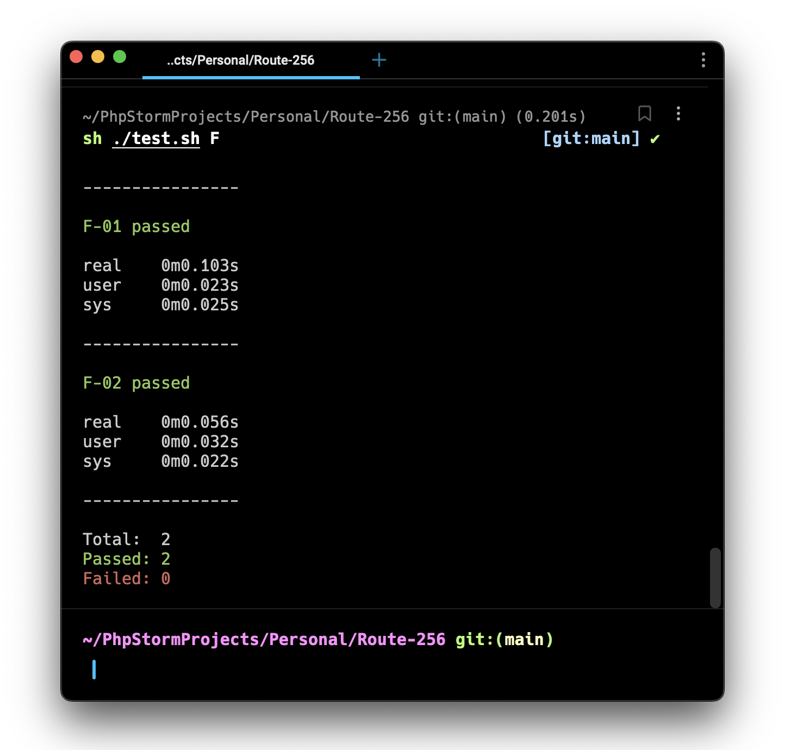

# Задачи из песочницы и варианты их решения - Route 256

Тексты заданий, тестовые данные и варианты решения на php в рамках соревнований https://route256.contest.codeforces.com/

## Тестирование
### Запуск всех семплов группы:
```bash
sh ./test.sh F
```
Пример результата:


### Запуск конкретного семпл задания:
```bash
sh ./test.sh F 01
```
Здесь параметр F - индекс задания, 01 - используемый семпл.
